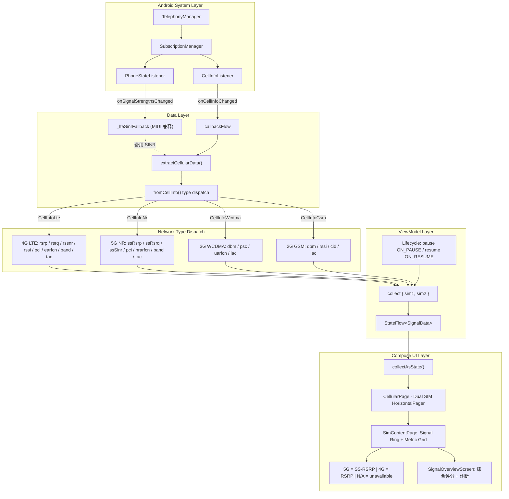

# Signal Insight - 信号监测仪

一款专业的 Android **蜂窝网络信号监测**工具，基于 Jetpack Compose + Material 3 开发。
实时展示 2G/3G/4G/5G 信号的各项核心指标，区分各网络类型参数差异，并提供详细的科普解读。

---

## 信号监听原理



### 核心流程说明

1. **系统监听**：`TelephonyManager` + `TelephonyCallback.CellInfoListener` 注册回调，监听基站信号变化
2. **MIUI 兼容**：额外注册 `PhoneStateListener`，解决 MIUI 设备上 CellInfo 不返回 LTE RSSNR 的问题，通过 SignalStrength 路径获取备用 SINR
3. **数据提取**：`callbackFlow` 将回调转为协程 Flow，`extractCellularData()` 解析 `CellInfo` 列表
4. **类型分流**：`fromCellInfo()` 根据 `CellInfo` 实际类型（LTE/NR/WCDMA/GSM）分别提取可用参数
5. **ViewModel 处理**：通过 `MutableStateFlow` → `.map{}.stateIn()` 转为不可变 UI 状态
6. **Compose 渲染**：`collectAsState()` 收集 StateFlow，驱动 UI 响应式更新

### 各网络类型参数差异

| 参数 | 5G NR | 4G LTE | 3G WCDMA | 2G GSM |
|------|-------|--------|---------|--------|
| **RSRP** | **SS-RSRP** (ssRsrp→csiRsrp) | RSRP (rsrp) | N/A | N/A |
| **RSRQ** | **SS-RSRQ** (ssRsrq→csiRsrq) | RSRQ (rsrq) | N/A | N/A |
| **SINR** | **SS-SINR** (ssSinr→csiSinr) | rssnr 作为 SINR 等效值 | N/A | N/A |
| **RSSI** | N/A（NR 无此概念） | rssi | N/A | rssi |
| **PCI** | pci | pci | psc（主扰码） | cid（小区ID） |
| **频率** | nrarfcn | earfcn | uarfcn | N/A |
| **频段** | bands API | bands API | N/A | N/A |
| **TAC** | tac | tac | lac | lac |

---

## 功能特性

### 📊 实时信号监测
- **双卡同时监测**：HorizontalPager 左右滑动切换 SIM 卡
- **弹性水滴切换器**：底部 SIM 切换采用独立双边界弹簧动画，模拟液滴拉伸吸附效果
- **信号环形进度条**：绿/黄/红三色直观指示信号强度
- **8 大核心指标网格**：按网络类型自适应标签（5G 显示 SS-RSRP，4G 显示 RSRP）
- **不可用指标自动隐藏**：3G/2G 不支持的参数显示 N/A
- **信号综合分析**：点击信号环进入综合评分页面，含评分环+诊断说明+短板建议

### 📖 参数科普解读
点击每个指标格块进入全屏详情页：

| 指标 | 科普内容 |
|------|---------|
| **RSRP / SS-RSRP** | 信号强度范围 + 影响因素 + 当前值个性化评估 |
| **RSRQ / SS-RSRQ** | 信号质量分级 + RSRP/RSRQ 联合判断 |
| **SINR / SS-SINR** | 信噪比 → 下载速度映射表 + 评估 |
| **RSSI** | RSSI vs RSRP 对比 + 什么时候参考 RSSI |
| **Band** | 运营商频段分布表（移动/联通/电信/广电），根据当前频段动态显示提示 |
| **PCI** | 基站切换原理 + PCI Mod 3 干扰 |
| **EARFCN** | 频率换算公式 + 运营商频点范围 |
| **TAC** | TAC 更新场景 + 作用说明 |

### 🌐 国际化
- **中文 / 英文自动切换**（跟随系统语言）
- 所有 UI 文本、科普内容均双语

### 🎨 主题
- Material Design 3（Material You）
- 支持浅色/深色模式 + 动态取色
- 支持多套预设配色方案

---

## 技术栈

| 组件 | 技术 | 版本 |
|------|------|------|
| 语言 | Kotlin | 2.4.0 |
| UI 框架 | Jetpack Compose + Material 3 | BOM 2026.05.00 |
| 导航 | Jetpack Navigation Compose | 2.9.8 |
| 架构 | MVVM (Repository + ViewModel + StateFlow) | - |
| 异步 | Kotlin Coroutines + Flow + StateFlow | - |
| 构建系统 | Gradle | 9.5.1 |
| AGP | Android Gradle Plugin | 9.2.0 |
| 动画 | spring + tween + AnimatedContent + AnimatedVisibility | - |
| 测试 | Compose UI Test (ui-test-junit4) | - |
| 编译 SDK | Android 16 (API 36) | - |
| 最低支持 | Android 12 (API 31) | - |

---

## 项目结构

```
app/src/main/java/cn/debubu/signalinsight/
├── data/
│   ├── cellular/
│   │   ├── CellularRepository.kt          # TelephonyManager + callbackFlow + PhoneStateListener
│   │   ├── CellularSignalModel.kt         # 数据模型 + 各网络类型参数解析
│   │   └── SignalQualityEvaluator.kt      # 综合评分算法
│   ├── permission/
│   │   └── PermissionManager.kt           # 权限管理（含永久拒绝检测）
│   └── theme/
│       └── ThemeManager.kt                # 主题管理器（浅色/深色/配色方案）
├── ui/
│   ├── cellular/
│   │   ├── CellularPage.kt                # 双卡切换主页面（HorizontalPager）
│   │   ├── CellularViewModel.kt           # 视图模型（StateFlow 驱动）
│   │   ├── SimContentPage.kt              # 单卡信号内容（信号环+指标网格+邻小区）
│   │   ├── SignalOverviewScreen.kt        # 信号综合分析页（评分环+诊断）
│   │   ├── BandExplainer.kt ~ TACExplainer.kt  # 8 个科普组件
│   │   └── ExplainerUtils.kt              # 共享组件（SectionCard / MetricExplainerShell）
│   ├── components/
│   │   └── ElasticSimSwitcher.kt          # 弹性水滴双卡槽切换器（双边界弹簧动画）
│   ├── main/
│   │   └── MainScreen.kt                  # 主界面（NavHost + 侧边抽屉 + 生命周期）
│   ├── permission/
│   │   ├── PermissionScreen.kt            # 权限申请页面
│   │   └── PermissionViewModel.kt         # 权限视图模型
│   ├── settings/
│   │   ├── SettingsScreen.kt              # 设置页面（主题切换）
│   │   └── ThemeViewModel.kt              # 主题视图模型
│   └── theme/
│       ├── Color.kt / Theme.kt / Type.kt   # Material 3 主题
│       └── ColorSchemePresets.kt           # 预定义配色方案
├── MainActivity.kt                        # 应用入口
└── SignalInsightApplication.kt            # Application 类（单例仓库）
```

---

## 导航架构

基于 **Jetpack Navigation Compose**，统一管理所有页面路由：

| 路由 | 页面 | 动画 |
|------|------|------|
| `cellular` | 信号监测页 | fadeIn(250) / fadeOut(150) |
| `settings` | 设置页 | fadeIn(250) / fadeOut(150) |
| `about` | 关于页 | fadeIn(250) / fadeOut(150) |
| `explainer/{metricKey}` | 参数详解页 | 右滑入 + 淡入 / 左滑出 + 淡出（对称） |
| 底部 SIM 切换栏 | 仅在 cellular 页显示 | 延迟 300ms 闪现（等页面动画播完） |

---

## 构建指南

### 环境要求
- **JDK** 17+（推荐 Microsoft JDK 21）
- **Android SDK** API 31 + API 36
- **Gradle** 9.5.1（gradlew 自动下载）

### 快速开始

```bash
# 克隆
git clone https://gitee.com/debumao/SingnalInsight.git
cd SingnalInsight

# 构建 Debug
./gradlew assembleDebug

# 运行测试（需要连接手机/模拟器）
./gradlew connectedDebugAndroidTest

# 构建 Release（需要 keystore.properties 签名配置）
./gradlew assembleRelease
```

### 签名配置

项目内置了**公开测试密钥** `app/signal_insight.jks`（密码 `Android123`），克隆后可直接构建 Debug/Release 版本。

如需使用自己的密钥：

1. 生成自己的密钥库文件（如 `private-release.jks`），**不要提交到仓库**
2. 在项目根目录创建 `private-keystore.properties`（已加入 `.gitignore`）：
   ```properties
   storePassword=你的密码
   keyPassword=你的密码
   keyAlias=你的别名
   storeFile=private-release.jks
   ```
3. 构建系统会优先读取 `private-keystore.properties`，不存在时回退到公开密钥

---

## 权限说明

| 权限 | 用途 | API 级别 |
|------|------|---------|
| `ACCESS_FINE_LOCATION` | 访问 CellInfo（系统要求位置权限才能获取基站信息） | 必须 |
| `READ_PHONE_STATE` | 读取运营商名称、网络类型 | Android 12 及以下 |
| `READ_BASIC_PHONE_STATE` | 读取基本电话状态 | Android 13+ 替代 |

> 应用**不会**收集或上传任何位置信息或个人数据，所有数据仅在本地设备上处理。

---

## 开源协议

本项目基于 **Apache License 2.0** 协议开源，详见 [LICENSE](LICENSE) 文件。

```
Copyright 2026 hpmdr / debumao

Licensed under the Apache License, Version 2.0 (the "License");
you may not use this file except in compliance with the License.
You may obtain a copy of the License at

    http://www.apache.org/licenses/LICENSE-2.0

Unless required by applicable law or agreed to in writing, software
distributed under the License is distributed on an "AS IS" BASIS,
WITHOUT WARRANTIES OR CONDITIONS OF ANY KIND, either express or implied.
See the License for the specific language governing permissions and
limitations under the License.
```
